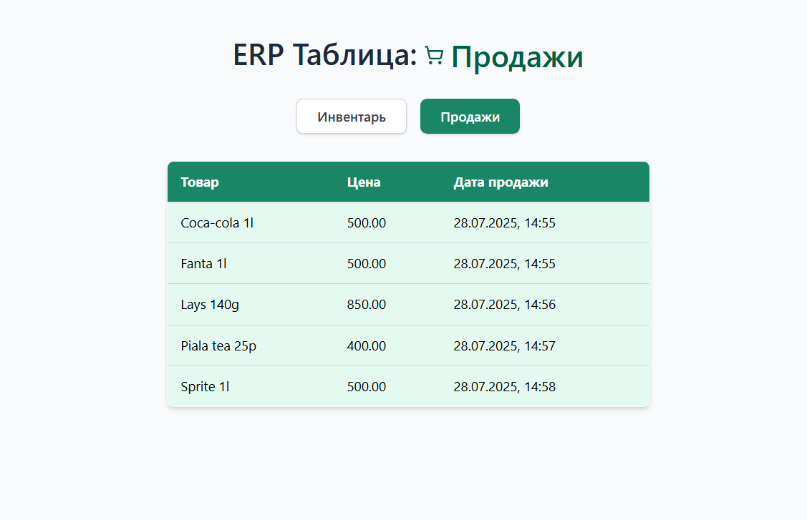

## 🧾 Каркас ERP-системы на Django + React + Docker

Используются:

* Django для backend,
* React + Vite + TypeScript для frontend,
* PostgreSQL как база данных,
* TailwindCSS для UI.
* Docker и Docker Compose для контейнеризации и деплоя.

---

## 🚀 Функциональность

* 📊 Отображение данных в таблицах (инвентар, продажа)
* 🔐 Админ-панель Django
* ⚙️ Автоматическая инициализация базы данных с тестовыми данными и создание суперпользователя
* 🌐 Разделение сервисов: `frontend`, `backend`, `nginx`

---

## 📁 Структура проекта

```
project-root/
│
├── backend/                     # Django проект
│   ├── erp_core/                # Основной Django-проект (settings.py, urls.py и т.д.)
│   ├── service_inventory/       # Первый микросервис (приложение)
│   ├── service_sales/           # Второй микросервис (приложение)
│   ├── Dockerfile
│   ├── manage.py
│   └── requirements.txt         # Зависимости Python
│   └── ...
│
├── frontend/                    # React + Vite фронтенд
│   ├── Dockerfile
│   └── ...
│
├── nginx/                       # Nginx конфигурация
│   └── default.conf
│
├── .env                         # Переменные окружения
├── docker-compose.yml           # Docker Compose конфигурация
└── README.md
```

---

## ⚙️ Установка и запуск

> Убедитесь, что у вас установлены *Docker* 
1. Клонируйте репозиторий:

```bash
git clone https://github.com/DariSarsen/erp-system.git
cd erp-system
```

2. Переименуйте файл `.env copy` на `.env` в корне проекта и заполните

3. Запустите проект:

```bash
docker-compose up --build
```

4. Откройте в браузере:
* 📊 Таблица ERP: [http://localhost:3000/](http://localhost:3000/)

---

## 🧪 Тестовые данные

Контейнер backend при запуске автоматически:

* выполняет миграции
* создаёт суперпользователя
* наполняет базу данными по моделям:

  * `InventoryItem`
  * `SaleTransaction`

---

## 🐳 Основные команды

* Собрать и запустить проект:

  ```bash
  docker-compose up --build
  ```
* Остановить:
  `Ctrl+C`
---

## 📷 Скриншоты



